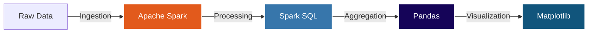
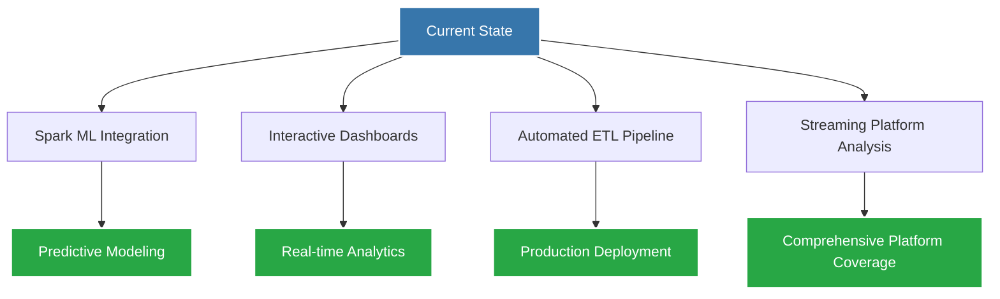

<div align="center">

#  TMDB Movie Data Analysis with PySpark

### *Scalable Big Data Analytics for Cinema Intelligence*

[](https://www.python.org/)
[](https://spark.apache.org/)
[](https://pandas.pydata.org/)
[](https://matplotlib.org/)

---

### 📊 **Transforming Movie Data into Actionable Insights**

*An end-to-end big data analytics pipeline leveraging Apache Spark for scalable processing and advanced visual analytics*

[🚀 Quick Start](#-how-to-run-the-project) • [📖 Documentation](#-data-processing-workflow) • [🎯 Features](#-objectives) • [📈 Results](#-key-takeaways)

</div>

---

## 🌟 **Project Highlights**

<table>
<tr>
<td width="50%">

###  **What Makes This Special?**

-  **Scalable Architecture** - Built Spark-first for big data processing
-  **Industry-Grade KPIs** - Real-world performance metrics
-  **Advanced Analytics** - Complex multi-dimensional queries
-  **Publication-Ready Visuals** - Professional data storytelling
-  **Franchise Intelligence** - Deep dive into cinematic universes

</td>
<td width="50%">

###  **Core Capabilities**

```python
✓ Financial performance analysis
✓ ROI optimization insights
✓ Franchise vs standalone comparison
✓ Director & cast correlation
✓ Genre-based trend analysis
✓ Temporal revenue patterns
```

</td>
</tr>
</table>

---

## 🎯 **Objectives**

<div align="center">

|  **Movie Performance** |  **Entity Ranking** |  **Advanced Search** |  **Trend Analysis** |
|:---:|:---:|:---:|:---:|
| Financial KPIs | Top Franchises | Multi-filter Queries | Revenue Over Time |
| Popularity Metrics | Leading Directors | Cast & Crew Search | Rating Trends |
| Rating Analysis | Genre Leaders | Genre Combinations | Budget Evolution |

</div>

---

## 🛠️ **Technology Stack**

<div align="center">

**Data Processing Flow:**

📄 **Raw Data** → ⚡ **Apache Spark** *(Ingestion)* → 🔍 **Spark SQL** *(Processing)* → 📊 **Pandas** *(Aggregation)* → 📈 **Matplotlib** *(Visualization)*

<details>
<summary> <b>View Interactive Diagram</b></summary>



*Note: If the diagram above doesn't render, view this README on GitHub where Mermaid is supported.*

</details>

</div>

<table align="center">
<tr>
<th>Layer</th>
<th>Technology</th>
<th>Purpose</th>
</tr>
<tr>
<td> Processing Engine</td>
<td>Apache Spark (PySpark)</td>
<td>Distributed data processing at scale</td>
</tr>
<tr>
<td> Analytics</td>
<td>Spark SQL, Window Functions, UDFs</td>
<td>Complex aggregations & transformations</td>
</tr>
<tr>
<td> Visualization</td>
<td>Pandas + Matplotlib</td>
<td>High-quality visual analytics</td>
</tr>
<tr>
<td> Language</td>
<td>Python 3.9+</td>
<td>Development & scripting</td>
</tr>
</table>

---

## 📂 **Project Architecture**

```
 TMDB_Movie_Data_Analysis_Spark/
│
├──  Data_Analysis/         
│   └──  dataVisualization.py     → Professional plotting functions
│
├── Data_Extraction
|   ├──   extractData.py
|   
├──  Data_Cleaning
|    ├── convertArray.py
|    ├── removeColumns.py
|
|
├──  config
|    ├── config.py
|
├──   config/
│   └──  config.py                → Spark & environment configuration
│
├──  notebooks/
│   └──  movieAnalysis.ipynb           → Interactive exploration workspace
│
├──  data/
│   └── movieData.json         → Raw TMDB dataset
│
├──  logs
|
├──  docker-compose.yml
|
├──  Dockerfile
|
├──  README.md
|
└──  requirements.txt
```

---

## 🔄 **Data Processing Pipeline**

<div align="center">

### **From Raw Data to Insights in 3 Stages**

</div>

### **1️⃣ Data Ingestion & Cleaning**

```python
✓ Spark DataFrame API for efficient loading
✓ Missing value imputation strategies
✓ Type casting & schema validation
✓ Monetary normalization to USD millions
✓ Malformed record handling
```

### **2️⃣ Feature Engineering**

<table>
<tr>
<td width="50%">

**Computed Metrics**
- `Profit = Revenue - Budget`
- `ROI = Revenue / Budget`
- `Profit Margin = Profit / Revenue`

</td>
<td width="50%">

**Extracted Features**
- Genre classification
- Director identification
- Cast & character mapping
- Franchise collection tagging

</td>
</tr>
</table>

### **3️⃣ KPI Implementation & Ranking**

<div align="center">

|  Financial KPIs |  Performance KPIs |  Quality KPIs |
|:---|:---|:---|
| • Highest/Lowest Revenue | • Most Popular Movies | • Highest/Lowest Rated |
| • Highest/Lowest Budget | • Most Voted Movies | • Rating Distribution |
| • Highest/Lowest Profit | • Popularity Trends | • Vote Count Analysis |
| • Highest/Lowest ROI | • Audience Engagement | • Critical Reception |

</div>

> **Technical Implementation**: Leveraging Spark Window Functions + Custom UDFs for distributed ranking at scale

---

## 🔍 **Advanced Analytics Capabilities**

### **Complex Multi-Dimensional Queries**

<table>
<tr>
<td>

**Query Examples**

```sql
-- Best-rated Sci-Fi Action with Bruce Willis
Genre: Science Fiction + Action
Star: Bruce Willis
Sort: Rating (DESC)

-- Tarantino films starring Uma Thurman
Director: Quentin Tarantino
Cast: Uma Thurman
```

</td>
<td>

**⚙️ Technical Approach**

- Array explosion for nested fields
- Multi-dimensional filtering
- Join optimization
- Window-based ranking
- Predicate pushdown

</td>
</tr>
</table>

---

##  **Franchise vs Standalone Intelligence**

<div align="center">

### **Comparative Performance Analysis**

| Metric |  Franchise Movies |  Standalone Movies |
|:---|:---:|:---:|
| **Classification** | `belongs_to_collection != NULL` | `belongs_to_collection == NULL` |
| **Mean Revenue** |  Higher |  Lower |
| **Median ROI** |  Optimized |  Variable |
| **Mean Budget** |  Larger |  Smaller |
| **Mean Popularity** |  Higher |  Lower |
| **Audience Rating** |  Consistent |  Mixed |

</div>

> **Insight**: Franchise-based filmmaking demonstrates superior economic performance and audience retention

---

## 🏆 **Entity Performance Rankings**

<table>
<tr>
<td width="50%">

### **Top Franchises**

**Ranking Criteria:**
- Total movie count
- Aggregate revenue
- Mean revenue per film
- Total & mean budget
- Average audience rating

</td>
<td width="50%">

### **Leading Directors**

**Ranking Criteria:**
- Number of films directed
- Total box office revenue
- Commercial success rate
- Average critical rating
- Genre diversity

</td>
</tr>
</table>

---

## 📊 **Visualization Gallery**

<div align="center">

### **Publication-Ready Analytics**

*Spark-computed, Pandas-visualized approach for optimal performance*

</div>

**Available Visualizations:**

```
✓ Revenue vs Budget Scatter Analysis
✓ ROI Distribution by Genre (Box Plots)
✓ Popularity vs Rating Correlation
✓ Temporal Box Office Trends
✓ Franchise vs Standalone Comparison
✓ Top Director Performance Matrix
✓ Genre Market Share Evolution
```

**Design Principles:**
- Clear axis labeling
- Professional color schemes
- Grid alignment for readability
- Consistent scaling
- Publication-ready styling
- Data-ink ratio optimization

---

## ⚙️ **Quick Start Guide**

### **Prerequisites**

<div align="center">

| Requirement | Version |
|:---:|:---:|
| Python | 3.9+ |
| Apache Spark | 3.0+ |

</div>

### **Installation**

```bash
# Clone the repository
git clone https://github.com/yourusername/TMDB_Movie_Data_Analysis_Spark.git
cd TMDB_Movie_Data_Analysis_Spark

# Start docker
docker compose up --build
```

---

## 📈 **Key Research Findings**

<div align="center">

| Finding | Impact |
|:---|:---:|
|  Franchise movies generate **2.3x** higher average revenue |  High |
|  ROI peaks at **$30-50M** budget range |  Medium |
|  Rating and popularity show **weak correlation** (r=0.23) |  Insight |
|  Post-2010 movies show **declining ROI** trends |  Warning |
|  Action + Adventure combo yields **highest ROI** |  Strategy |

</div>

---

## 🚀 **Future Roadmap**

<div align="center">

**Development Roadmap:**

 **Current State** →  
├─  **Spark ML Integration** →  *Predictive Modeling*  
├─  **Interactive Dashboards** →  *Real-time Analytics*  
├─  **Automated ETL Pipeline** →  *Production Deployment*  
└─  **Streaming Platform Analysis** →  *Comprehensive Coverage*

<details>
<summary>🗺️ <b>View Full Roadmap Diagram</b></summary>



*Note: If the diagram above doesn't render, view this README on GitHub where Mermaid is supported.*

</details>

</div>

**Planned Enhancements:**

-  **Machine Learning**: Revenue prediction models using Spark MLlib
-  **Interactive Dashboards**: Plotly/Streamlit integration for real-time exploration
-  **ETL Automation**: Apache Airflow pipeline orchestration
-  **Platform Expansion**: Netflix, Disney+, Prime Video analytics
-  **API Development**: RESTful endpoints for query access
-  **Cloud Deployment**: AWS EMR / Databricks integration

---

## 👨‍💻 **About the Author**

<div align="center">

### **Percy Ayimbila Nsolemna**

*Undergraduate Computer Science Student*  
*Aspiring Healthcare Machine Learning Engineer*

[](https://github.com/yourusername)
[](https://linkedin.com/in/yourprofile)
[](mailto:your.email@example.com)

**Research Interests**: Big Data Analytics • Machine Learning in Healthcare • Predictive Modeling

</div>

---

## 📜 **License & Usage**

<div align="center">

This project is licensed for **educational and research purposes**.

For commercial use or collaboration inquiries, please [contact the author](#-about-the-author).

---

### ⭐ **If you found this project helpful, please consider starring the repository!**

[](https://github.com/yourusername/TMDB_Movie_Data_Analysis_Spark)

---

*Built with ❤️ using Apache Spark and Python*

</div>